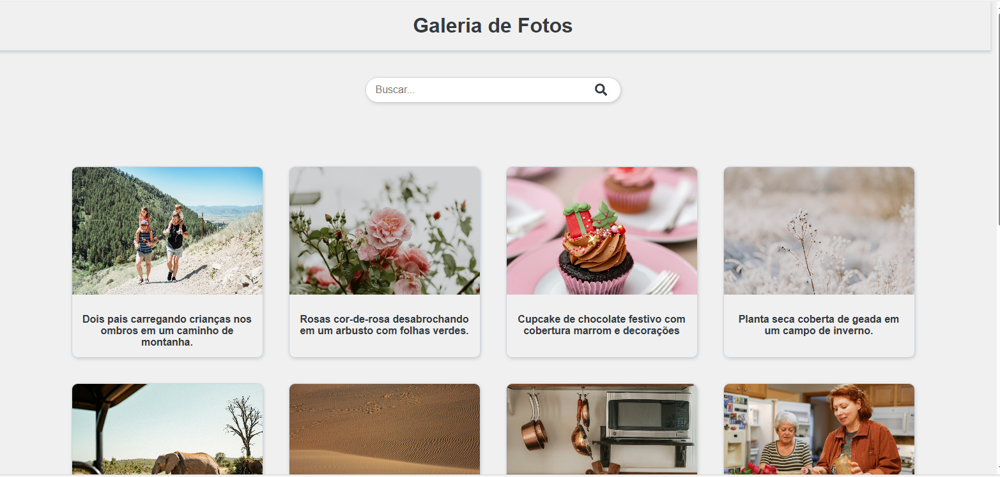
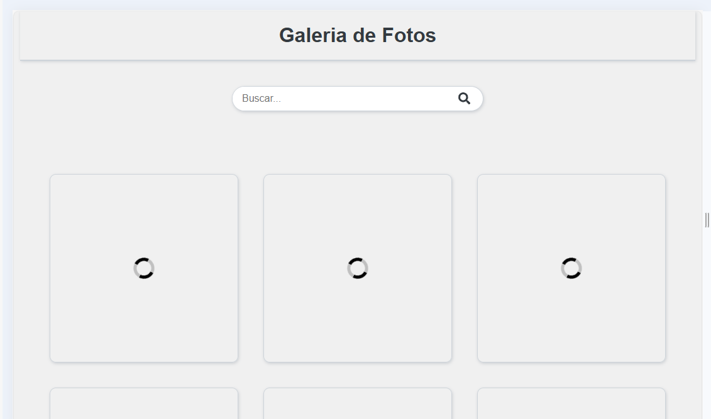
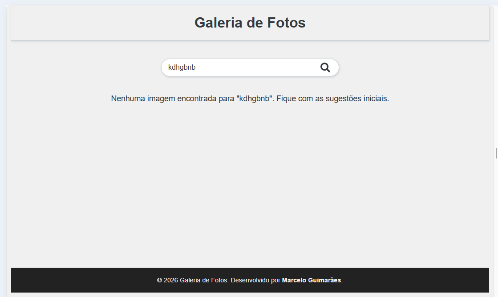

# 📸 Galeria de Fotos - React

Este projeto é uma aplicação web de galeria de fotos desenvolvida como parte do exercício de programação (2026/1). A aplicação consome a API do **Unsplash** para listar e buscar imagens de alta qualidade, apresentando-as em um layout responsivo e moderno.

## 📋 Funcionalidades

- **Exibição de Fotos:** Carregamento inicial de fotos aleatórias/populares direto da API do Unsplash.


- **Busca Inteligente:** Barra de pesquisa que permite encontrar fotos por palavras-chave.


- **Layout Responsivo:** Utilização de CSS Grid (`auto-fit`) para adaptar o número de colunas automaticamente ao tamanho da tela (Mobile, Tablet e Desktop).
- **Feedback Visual:** Indicadores de carregamento (Loaders) 


 mensagens de erro ou "nenhum resultado encontrado".
- **Interface Limpa:** Design focado na experiência do usuário e na visualização das imagens.



## 🛠 Tecnologias Utilizadas

- **React.js**: Biblioteca JavaScript para construção da interface.
- **Axios**: Para requisições HTTP à API.
- **CSS3**: Grid Layout, Flexbox e variáveis CSS.
- **Unsplash API**: Fonte das imagens e dados.
- **React Icons**: Ícones para a interface (Lupa, Loaders).

## 🚀 Como rodar o projeto localmente

Siga os passos abaixo para baixar e executar a aplicação na sua máquina:

### 1. Pré-requisitos
Certifique-se de ter o **Node.js** instalado em sua máquina.

### 2. Clonar o repositório
```bash
git clone [https://github.com/SEU-USUARIO/NOME-DO-REPOSITORIO.git](https://github.com/SEU-USUARIO/NOME-DO-REPOSITORIO.git)
cd NOME-DO-REPOSITORIO
3. Instalar dependências
Bash

npm install
4. Configurar a API Key
Para que a busca funcione, é necessário uma chave de acesso do Unsplash.

Crie uma conta em Unsplash Developers.

Crie uma nova aplicação para obter sua Access Key.

No arquivo src/pages/Home/index.js (ou onde estiver sua lógica), substitua a variável UNSPLASH_ACCESS_KEY pela sua chave.

Nota: Em um ambiente de produção real, recomenda-se usar um arquivo .env para proteger a chave.

5. Rodar a aplicação

npm run dev

O projeto abrirá automaticamente no seu navegador em http://localhost:3000.

📂 Estrutura do Projeto
src/
  ├── components/
  │   ├── Card/
  │   ├── Footer/
  │   ├── Header/
  │   ├── Loader/
  │   └── SearchBar/
  ├── pages/
  │   └── Home/
  ├── services/ (Opcional)
  ├── App.js
  └── index.js

✒️ Autor
Desenvolvido por Marcelo Guimarães.

Projeto criado para fins de estudo e portfólio. Entre em contato! [Seu LinkedIn aqui] | [Seu Email aqui]

© 2026 Galeria de Fotos.


***
